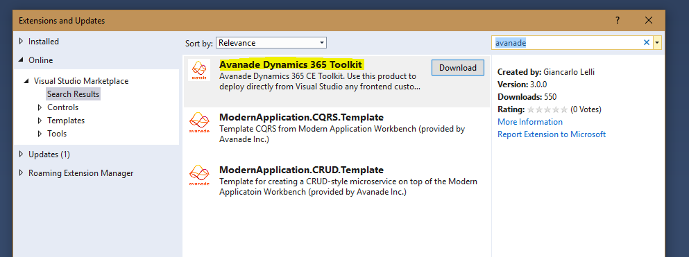
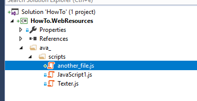
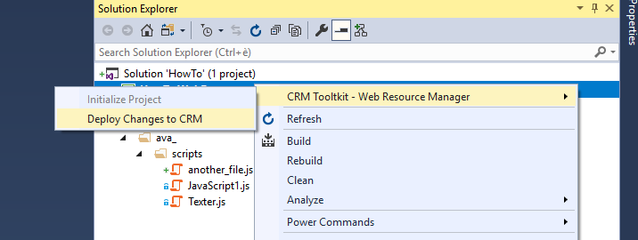

# Avanade Dynamics 365 Toolkit
{: style="text-align: justify"}
This is the official public repository for the Avanade Dynamics 365 Toolkit. In this repository you can get in touch with its maintainer and open issues. The goal of this Visual Studio extension is to support the Dynamics CE developer during the development of frontend customization for the Dynamics user interface (ex: custom web resources, javascript, html & css files) so that he doesen't need to use multiple tool to write code and publish the changes to the CRM.  
  
The Avanade Dynamics 365 Toolkit come with the following built in features:
- Native integration with Git to automatically commit the changes upon a succesful publish;
- 1:1 replication inside the CRM of the project structure;
- Automatic add of item to a configured solution;
- Automatic publish of changes in case of update;
- Git integration for automated commits after a succesfull publish operation;

## Installation
You can install this extension by searching for it in the marketplace, or by browsing to [this](https://marketplace.visualstudio.com/items?itemName=GiancarloLelli.AvanadeCRMToolkit) url.

## Configuration
You can start using the toolkit after a correct configuration step. In order to configure the toolkit you must strcture your Visual Studio Solution and Project in as depicted in the image below.  
In brief:
* At the root level you only have the solution
* Inside the solution, you only have one project
* All the Javascript, HTML, CSS file are placed under a folder that has the same as your publisher prefix in CRM

## Publish profile
{: style="text-align: justify"}
Once the extension is installed and you solution/project is correctly configured, you can initialize your project by right clicking in the project node, hovering over the *Web Resource Manager* node, clicking on *Initialize project*. Once the project is initialized, you can click on the *Deploy Changes to Dynamics 365* menu item to start the publishing process.

{: style="text-align: justify"}
Once the project isinitialized, you can click on the publish menu item. If that is your first publish for that specific project, it is required to create a publish profile. The required information for a publish profile are:
* Dynamics 365 CE Connection String, see [here](https://docs.microsoft.com/en-us/dynamics365/customer-engagement/developer/xrm-tooling/use-connection-strings-xrm-tooling-connect) for examples;
* Name of the solution used to group you customizations;
* Publisher prefix;
* Git branch name (it is required but for now this settings is ignored)
* Flasg to enable/disable automatic commit & push;

{: style="text-align: justify"}
Once the publish profile is completed, you can press *Save & Close* and the pusblish operation should start. You can monitor the progress via the custom output window panel called *Avanade Dynamics 365 Toolkit - Publish output*

## Known issues
{: style="text-align: justify"}
At the time of releasing v3.0 of the extension, the states of the two menu item *Initialize project* and *Deploy changes to Dynamics 365* are not enabled/disabled correctly. To work around this issue, you must remember to click on *Initialize* only **once** - We are working to fix this issue that has emerged once we migrated the extension to the new SDK.

{: style="text-align: justify"}
The branch name required during the creation of the publish profile for now is a redundant settings. It'll be removed in the next version (3.1)

## Contact & Licence
{: style="text-align: justify"}
This project is distributed under MIT license.  
Feel free to send suggestion and bug reports at [this address](mailto:dyntlksupport@avanade.com).

